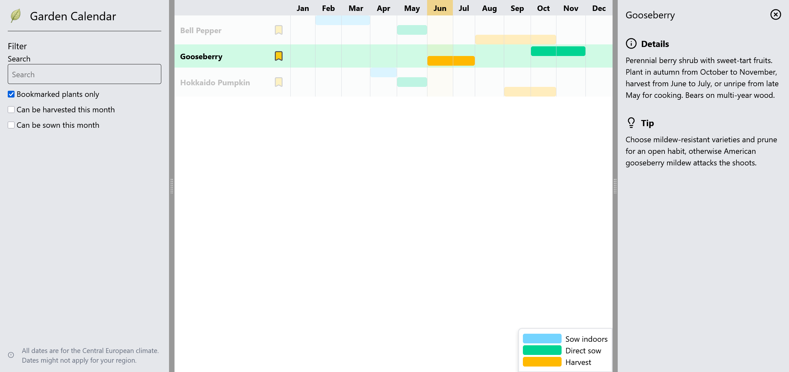

# Garden Calendar

Know when to sow your plants at a glance. A personal project to practice Angular.

[🌐 Try it out!](https://stockifab.github.io/Garden-Calendar/)

# Features

- Show sowing and harvesting months for 50 popular plants
- Gardening tips for all plants
- Bookmark your own plants for easy access
- Filter plants to only show the ones that need to be sown this month...
- ...or search by name or harvest month

# Tech Stack

- Angular
- Typescript
- Tailwind CSS

# Goal

I built this project because I wanted to refresh my Angular skills, in hindsight, this project wasn't ideal for
this because I didn't get to use a lot of Angular features.
Nevertheless, it wasn't for nothing, and I learnt something along the way.

# Use of AI

AI was used to generate all data displayed on the site, including plant names, sowing and harvesting months,
plant details, and gardening tips.

AI also generated the logo, banner, and empty state illustration.
